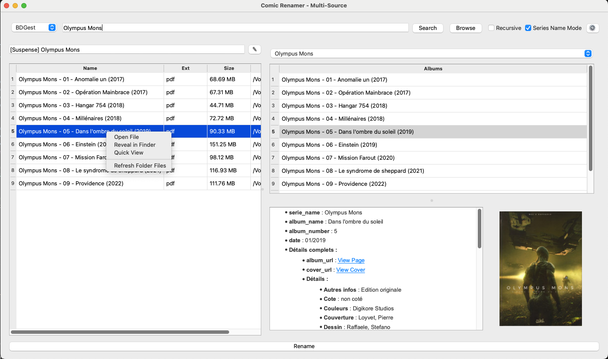
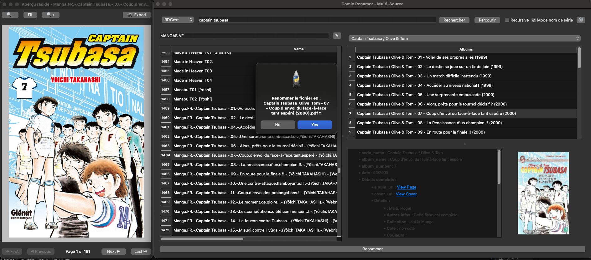

# ComicsRename 📚

<div align="center">
  
  
  **A powerful Python GUI application for organizing and renaming comic book files**
  
  
  
  
  
</div>

---

## 💭 Why ComicsRename?

Are you **too lazy** to rename manually all your comic files in your storage? **Too lazy** to search manually for the correct series name, the proper title, and all those details? That's exactly why I created and use **ComicsRename**! 

I was tired of spending hours organizing my comic collection, hunting down metadata, and fixing inconsistent file names. So I built this tool to automate the entire process. Now I'm happy to share it with you - and I'd love to hear from you if it helps you too! 🎉

**ComicsRename** transforms the tedious task of organizing comic book files into a breeze, using metadata from **BDGest** and **ComicVine** databases.

## 📸 Screenshots

<div align="center">
  
### Main Interface
*The clean, intuitive interface showing file management and metadata search*



### Metadata Search & Display - File Organization
*Rich metadata display with cover images and detailed information*
*Drag & drop file management with smart organization features*



</div>

## 🌟 Features

<div align="center">
  
</div>

<table>
<tr>
<td width="50%">

### 🔍 **Dual Metadata Sources**
-  **BDGest Integration**: French comic database
-  **ComicVine Integration**: International comics database

### 📖 **Smart Search Modes**
-  **Series Name Mode**: Browse albums within series
-  **Album Search**: Direct album/issue search
-  **Auto-population**: Automatically load albums

### 🎨 **Rich Metadata Display**
-  **Cover Images**: High-quality cover art
-  **Detailed Information**: Dates, descriptions, teams
-  **Album Details**: ISBN, publisher, page count

</td>
<td width="50%">

### 🗂️ **File Management**
-  **Drag & Drop**: Intuitive file organization
-  **Folder Renaming**: With validation and confirmation
-  **Bulk Operations**: Handle multiple files efficiently
-  **Smart Scanning**: CBZ, CBR, PDF, etc.

### 🔒 **Security & Credentials**
-  **Secure Storage**: Encrypted credential storage
-  **Environment Variables**: Support for .env files
-  **No Hardcoded Keys**: All API keys stored securely

### ⚡ **Performance Optimizations**
-  **Session Management**: Persistent authentication
-  **Parallel Processing**: Multi-threaded fetching
-  **Caching**: Efficient data caching and reuse

</td>
</tr>
</table>

## 🚀 Getting Started

<div align="center">
  
</div>

### Prerequisites

- **Python 3.8+** (recommended: Python 3.9 or higher)
- **Operating System**: Windows, macOS, or Linux

### 📦 Installation Options

#### Option 1: Package Installation (Recommended)
```bash
# Install from the latest release package
pip install comicsrename-3.3.0-py3-none-any.whl

# Or from source distribution
pip install comicsrename-3.3.0.tar.gz
```

#### Option 2: Development Installation
1. **Clone the repository**:
   ```bash
   git clone https://github.com/r45635/ComicsRename.git
   cd ComicsRename
   ```

2. **Create a virtual environment** (recommended):
   ```bash
   python -m venv venv
   source venv/bin/activate  # On Windows: venv\Scripts\activate
   ```

3. **Install dependencies**:
   ```bash
   pip install -r requirements.txt
   ```

4. **Set up credentials** (optional, for BDGest access):
   ```bash
   python setup_credentials.py
   ```

### Running the Application

```bash
### 🚀 Running the Application

<div align="center">
  
</div>

```bash
python main.py
```

## 📖 Usage Guide

<div align="center">
  
</div>

### 🎯 Quick Start Workflow

<table>
<tr>
<td width="50%">

#### 1. **Initial Setup** 
- Launch the application using `python main.py`
- Configure credentials (if using BDGest)
- Set ComicVine API key (if using ComicVine)

#### 2. **Basic Workflow** 
- **Select a folder** containing comic files
- **Choose metadata source** (BDGest or ComicVine)
- **Search for series or albums**
- **Review metadata** and cover images

</td>
<td width="50%">

#### 3. **File Organization** 
- **Organize files** using drag & drop
- **Rename folders** by double-clicking folder names
- **Validate changes** with built-in confirmation

#### 4. **Advanced Features** 
- **Batch Processing**: Handle multiple folders
- **Metadata Comparison**: Compare sources
- **Session Persistence**: Auto authentication

</td>
</tr>
</table>

### 🔧 Configuration Options

| Feature | Description | Icon |
|---------|-------------|------|
| **BDGest Setup** | Configure French comic database access |  |
| **ComicVine API** | Set up international database access |  |
| **Environment Variables** | Use `.env` file for secure configuration |  |

## 🎨 Visual Identity

<div align="center">
  
### Application Icon
  


**ComicsRename** features a custom-designed icon representing comic book organization and file management. The icon is available in multiple formats:

| Format | Size | Usage |
|--------|------|-------|
|  | 16x16 | System tray, small icons |
|  | 32x32 | Interface elements |
|  | 64x64 | Application windows |
|  | 128x128 | High-resolution displays |
|  | 256x256 | Documentation, README |

The icon design incorporates:
- 📚 **Comic book elements** representing the core functionality
- 🗂️ **File organization symbols** showing the management aspect
- 🎨 **Modern design** with clean lines and vibrant colors

</div>

## 🤝 Contributing

<div align="center">
  
</div>

We welcome contributions! Here's how you can help:

- 🐛 **Report bugs** and issues
- 💡 **Suggest new features** 
- 🔧 **Submit pull requests**
- 📖 **Improve documentation**
- 🌍 **Add translations**

## 📄 License

This project is licensed under the MIT License - see the [LICENSE](LICENSE) file for details.

## 🙏 Acknowledgments

<div align="center">
  
</div>

- **BDGest**: For providing comprehensive French comic book metadata
- **ComicVine**: For the extensive international comics database
- **PySide6 Team**: For the excellent Qt-based GUI framework
- **Python Community**: For the amazing tools and libraries

---

<div align="center">
  


**Made with ❤️ for comic book enthusiasts**

**ComicsRename v3.3.0** | [Repository](https://github.com/r45635/ComicsRename) | [Issues](https://github.com/r45635/ComicsRename/issues) | [Releases](https://github.com/r45635/ComicsRename/releases)

*Transform your comic collection organization from tedious to effortless!*

</div>
